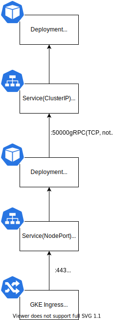

# GKE Ingress+Envoy+gRPC で、Ingress の Health Check をクリアして構築する

## tl;dr

- GKE の Ingress (L7 Load Balancer) では、HTTP(S) の GET Request で、Health Check が行われる
- gRPC アプリで、gRPC の Health Check を用意する
- Envoy で Lua を使って、GET リクエストを Envoy の Health Check と繋げることで Health Check をクリアさせる

## 問題点

GKE で、サービスを公開する手段として、L7 Load Balancer である Ingress を使うことが有効である。
しかし、GKE の標準の仕組みでは、カナリアリリースなどが行いにくいため、途中に gRPC のプロキシである Envoy を挟むことが有効である。

構成としては以下のようになる。



Ingress では、転送先のコンテナの Health Check が、HTTP(S)の GET リクエストで検証される。
ここでは、 Envoy のコンテナがチェックの対象になる。
しかし、gRPC のサービスとして Envoy を構築すると、HTTP(S)の GET リクエストに応答できないため、Ingress を使うことができない。

これを Envoy を使って回避する方法を解説する。

## 参考

以下の記事を参考にした。

- GKE gRPC Ingress LoadBalancing https://medium.com/google-cloud/gke-grpc-ingress-loadbalancing-4b9cdbc09758

## gRPC アプリ (Go) で Health Check を実装する

gRPC には、gRPC の本家がて依拠する Health Check Protocol がある。

https://github.com/grpc/grpc/blob/master/doc/health-checking.md

Go のこの Health Check Protocol の実装はパッケージ github.com/grpc/grpc-go/tree/master/health/grpc_health_v1 にある。

https://github.com/grpc/grpc-go/tree/master/health/grpc_health_v1

これを実装すると、以下のようになる。

```go
import (
	"google.golang.org/grpc/health/grpc_health_v1"
	"google.golang.org/grpc/status"
)

type healthCheck struct {}

// Health Check の実装
func (hc *healthCheck) Check(ctx context.Context, in *grpc_health_v1.HealthCheckRequest) (*grpc_health_v1.HealthCheckResponse, error) {

	// TODO: Health Check をここに実装する

	// OK を返答する例
	return &grpc_health_v1.HealthCheckResponse{
    Status: grpc_health_v1.HealthCheckResponse_SERVING
  }, nil
}


// 一旦 Watch は実装しない
func (hc *healthCheck) Watch(in *grpc_health_v1.HealthCheckRequest, srv grpc_health_v1.Health_WatchServer) error {
	return status.Error(codes.Unimplemented, "Watch is not implemented")
}
```

この Health Check のサービスを、本来のアプリケーションのサービスと一緒に gRPC サーバに登録して、実行できるようにする。

```go
package main

import (
  "net"

	"google.golang.org/grpc"

	"github.com/74th/try-envoy/router"
)

func main() {

	// gRPC サーバ
	s := grpc.NewServer()

  // 本来の gRPC アプリケーション の登録
	sv := &server{baseWay: baseWay}
	router.RegisterRouterServer(s, sv)

  // Health Checkの登録
	hc := &healthCheck{}
	grpc_health_v1.RegisterHealthServer(s, sv)

  // gRPC サーバの開始
  lis, err := net.Listen("tcp", addr)
  if err != nil {
    log.Fatalf("failed to listen: %v", err)
  }
  err = s.Serve(lis)
  if err != nil {
    log.Fatalf("failed to serve: %v", err)
  }
}
```

## Envoy に gRPC アプリの Health Check を行わせる

Envoy にバックエンド（Clusters）の Health Check を行うように設定する。
Envoy の Health Check では、grpc_health_check に設定をすることで、その gRPC を使ってバックエンドの Health Check を行うようになる。

```yaml
static_resources:
  listeners: {} # 省略

  clusters:
    - name: service

      # バックエンドサービスの設定
      connect_timeout: 0.05s
      type: STRICT_DNS
      http2_protocol_options: {}
      lb_policy: ROUND_ROBIN
      hosts:
        - socket_address:
            address: 127.0.0.1
            port_value: 50051
      load_assignment:
        cluster_name: server
        endpoints:
          - lb_endpoints:
              - endpoint:
                  address:
                    socket_address:
                      address: server1
                      port_value: 50000

      # Health Check の設定
      common_lb_config:
        healthy_panic_threshold:
          value: 50.0
      health_checks:
        - timeout: 1s
          interval: 5s
          interval_jitter: 1s
          no_traffic_interval: 5s
          unhealthy_threshold: 1
          healthy_threshold: 3
          grpc_health_check:
            service_name: "route.Router"
```

## Envoy で、GET リクエストで Health Check にアクセスさせる

Envoy には、Envoy を操作したり状態を取得するための、Administration interface がある。

https://www.envoyproxy.io/docs/envoy/latest/operations/admin

このバックエンドの状態を示す`/clusters`にアクセスすることで、バックエンドに行っている Health Check の結果を取得することができる。
正常な場合、以下のように、`health_flags`の属性に、状態が入っている。

```
service::10.60.3.44:50000::health_flags::healthy
```

Envoy では Lua を使うことで、ちょっとした応答ができるようになっている。
ここで、パス / の GET リクエストを受けた時に`/clusters`にアクセスし、バックエンドの 1 つでも正常である場合、HTTP(S)の 200 応答を返すようにする。

```lua
package.path = "/etc/envoy/lua/?.lua;/usr/share/lua/5.1/nginx/?.lua;/etc/envoy/lua/" .. package.path
function envoy_on_request(request_handle)

  if request_handle:headers():get(":path") == "/" then
    local headers, body = request_handle:httpCall(
    "local_admin",
    {
      [":method"] = "GET",
      [":path"] = "/clusters",
      [":authority"] = "local_admin"
    },"", 50)

    -- request_handle:logWarn(body)

    str = "service::%d+.%d+.%d+.%d+:%d+::health_flags::healthy"
    if string.match(body, str) then
      request_handle:respond({[":status"] = "200"},"ok")
    else
      request_handle:respond({[":status"] = "503"},"unavailable")
    end
  end
end
```

この Lua を Envoy の Lister の設定取り込むと以下のようになる。

```yaml
static_resources:
  listeners:
    - address:
        socket_address:
          address: 0.0.0.0
          port_value: 443
      filter_chains:
        - filters:
            - name: envoy.http_connection_manager
              config:
                access_log:
                  - name: envoy.file_access_log
                    config:
                      path: "/dev/stdout"
                codec_type: AUTO
                stat_prefix: ingress_https
                route_config:
                  name: local_route
                  virtual_hosts:
                    - name: http
                      domains: ["*"]
                      routes:
                        - match:
                            prefix: "/router.Router/"
                          route:
                            cluster: service
                http_filters:
                  - name: envoy.lua
                    config:
                      inline_code: |
                        package.path = "/etc/envoy/lua/?.lua;/usr/share/lua/5.1/nginx/?.lua;/etc/envoy/lua/" .. package.path
                        function envoy_on_request(request_handle)

                          if request_handle:headers():get(":path") == "/" then
                            local headers, body = request_handle:httpCall(
                            "local_admin",
                            {
                              [":method"] = "GET",
                              [":path"] = "/clusters",
                              [":authority"] = "local_admin"
                            },"", 50)

                            request_handle:logWarn(body)
                            str = "service::%d+.%d+.%d+.%d+:%d+::health_flags::healthy"
                            if string.match(body, str) then
                              request_handle:respond({[":status"] = "200"},"ok")
                            else
                              request_handle:respond({[":status"] = "503"},"unavailable")
                            end
                          end
                        end
                  - name: envoy.router
                    config: {}
"/etc/ssl/envoy/key.pem
```

なお、ここでは、Envoy のサービスは自己証明書の TLS を使っている。

## Ingress を Envoy につなぐ

最後に、この設定を有効にする Kubernetes のマニフェストを作成する。

### アプリ Deployment と Service

アプリケーション自体の Deployment を構成する。
gRPC サービスのため、Pod 自体の Health Check である Readiness Probe では、TCP ソケットがリスンされているかしかチェックできない。

```yaml
apiVersion: apps/v1
kind: Deployment
metadata:
  name: server1
spec:
  selector:
    matchLabels:
      app: server1
  template:
    metadata:
      labels:
        app: server1
    spec:
      containers:
        - name: server
          image: 74th/try-envoy-server:latest
          ports:
            - containerPort: 50000
          command:
            - ./server
            - -H
            - :50000
          readinessProbe:
            tcpSocket:
              port: 50000
```

Service では、Headless Service として構成させる。

```yaml
apiVersion: v1
kind: Service
metadata:
  name: server1
spec:
  selector:
    app: server1
  type: ClusterIP
  # Headless
  clusterIP: None
  ports:
    - name: server1
      protocol: TCP
      port: 50000
```

### Envoy の Deployment

Envoy の Deployment では、先の Health Check を Readiness Probe で使うように設定する。

```yaml
apiVersion: apps/v1
kind: Deployment
metadata:
  name: envoy
spec:
  replicas: 2
  selector:
    matchLabels:
      app: envoy
  template:
    metadata:
      labels:
        app: envoy
    spec:
      containers:
        - name: envoy
          image: envoyproxy/envoy-alpine:v1.14.1
          ports:
            - name: http
              containerPort: 443
          volumeMounts:
            - name: config
              mountPath: /etc/envoy
            - name: cert
              mountPath: /etc/ssl/envoy
          readinessProbe:
            httpGet:
              scheme: HTTPS
              path: /
              httpHeaders:
                - name: x-envoy-livenessprobe
                  value: healthz
              port: 443
            initialDelaySeconds: 3
          livenessProbe:
            httpGet:
              scheme: HTTPS
              path: /
              httpHeaders:
                - name: x-envoy-livenessprobe
                  value: healthz
              port: 443
            initialDelaySeconds: 10
          resources:
            requests:
              cpu: "100m"
              memory: "100M"
            limits:
              cpu: "1"
              memory: "1G"
      volumes:
        - name: config
          configMap:
            name: envoy-config
        - name: cert
          configMap:
            name: envoy-cert
```

なお、Envoy の設定である envoy.yaml と TLS の自己証明書は、ConfigMap として登録する（TLS の自己証明書に秘密鍵が含まれているが、この TLS にアクセスするのは Ingress のみであり、認証等に使っていないため、ConfigMap で登録している。
本来は TLS を必要としないが、GKE Ingress の場合、HTTP2 を有効にすると自動的に TLS が有効になっている必要がある。

```yaml
configMapGenerator:
  - name: envoy-cert
    files:
      - ./cert.pem
      - ./key.pem
  - name: envoy-config
    files:
      - envoy.yaml
```

### Envoy の Service と Ingress

Ingress を Pod と繋ぐためには、NodePort の Service を構築する。
Service の annotation には、 HTTP2 を使うように設定をする。
HTTP2 を有効にした場合、自動的に TLS を使って Health Check が行われるようになる。
また、ここで port に 443 を指定することで、Ingress で HTTPS が使えるようになる。

```yaml
apiVersion: v1
kind: Service
metadata:
  name: envoy
  annotations:
    cloud.google.com/neg: '{"envoy": {"443":{}}}'
    cloud.google.com/app-protocols: '{"envoy": "HTTP2"}'
spec:
  type: NodePort
  selector:
    app: envoy
  ports:
    - name: envoy
      protocol: TCP
      port: 443
      targetPort: 443
```

Ingress では Service を指定するのみで、特別な設定は必要としない。

```yaml
apiVersion: networking.k8s.io/v1beta1
kind: Ingress
metadata:
  name: try-envoy
  annotations:
    # HTTPS になる
    kubernetes.io/ingress.allow-http: "false"
    # Static IP
    kubernetes.io/ingress.global-static-ip-name: try-envoy-ip
    # Managed Cert
    networking.gke.io/managed-certificates: try-envoy-cert
spec:
  rules:
    - http:
        paths:
          - path: /*
            backend:
              serviceName: envoy
              servicePort: 443
```

## むすび

Envoy で Lua を使うことで、gRPC のサービス出会ったとしても、Ingress での Health Check を満たすことができる。

何がともあれ、早く GCP の Health Check で gRPC ベースのものが出てくるのを願うばかりである。
